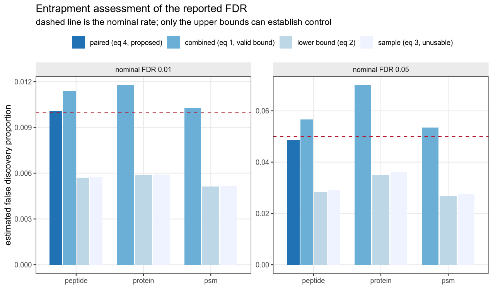
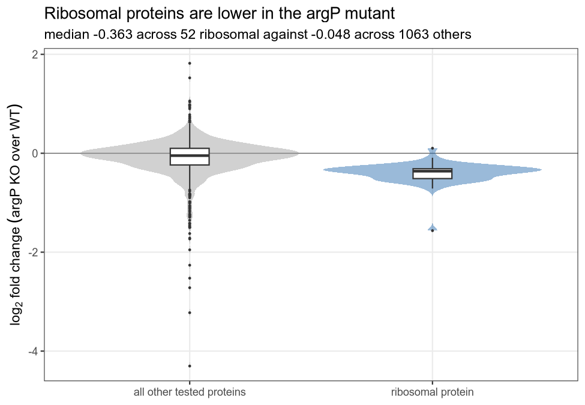
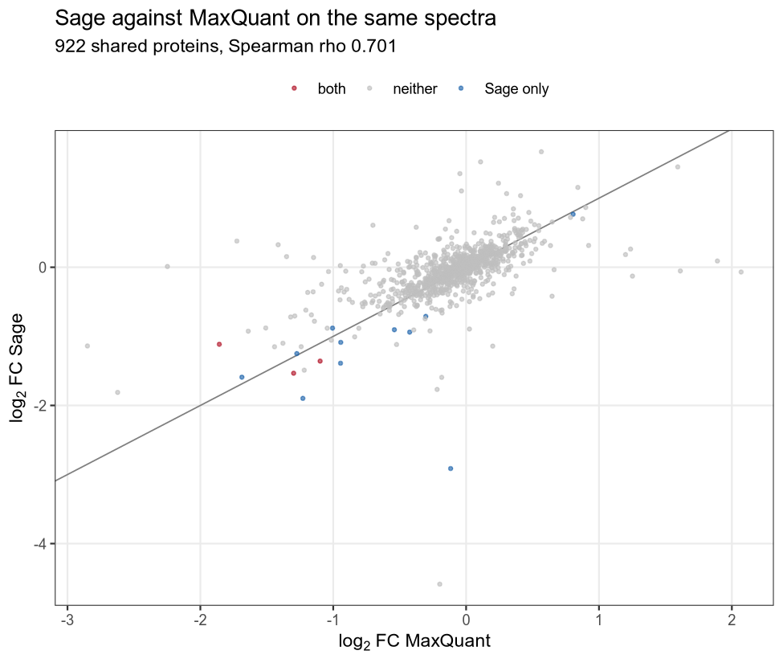
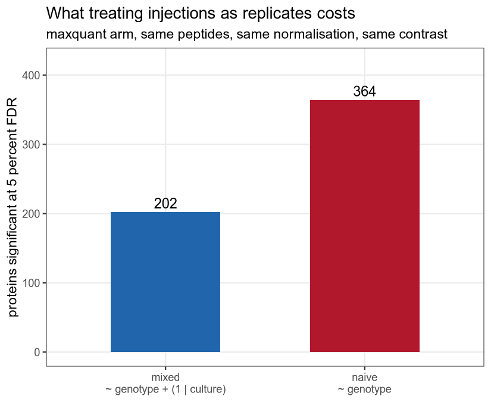
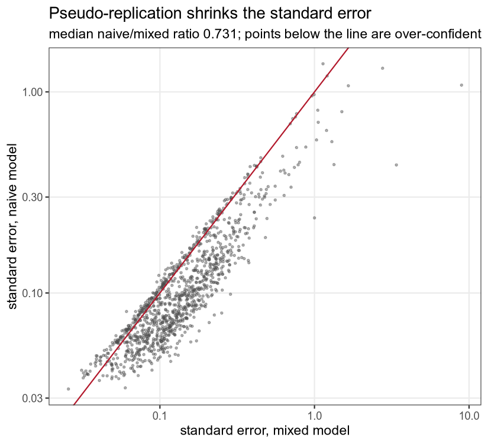
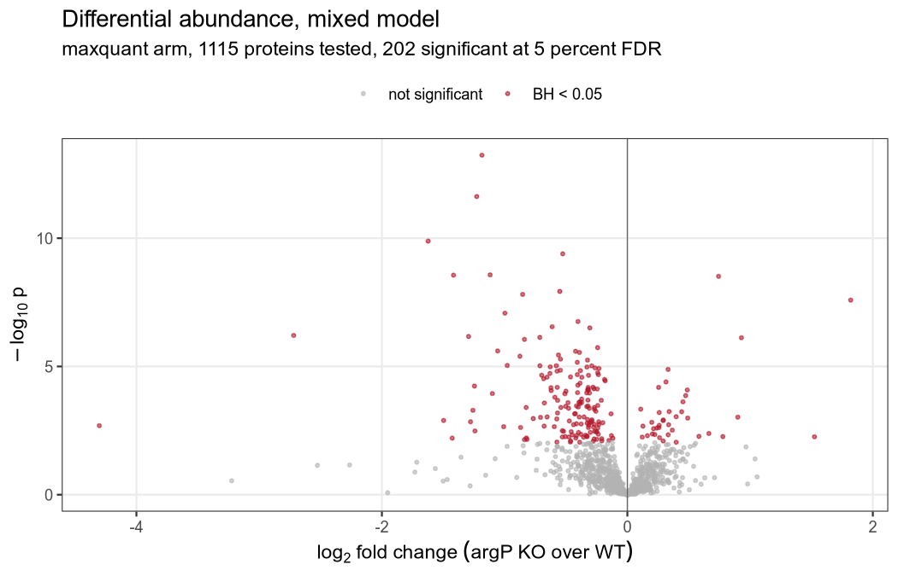
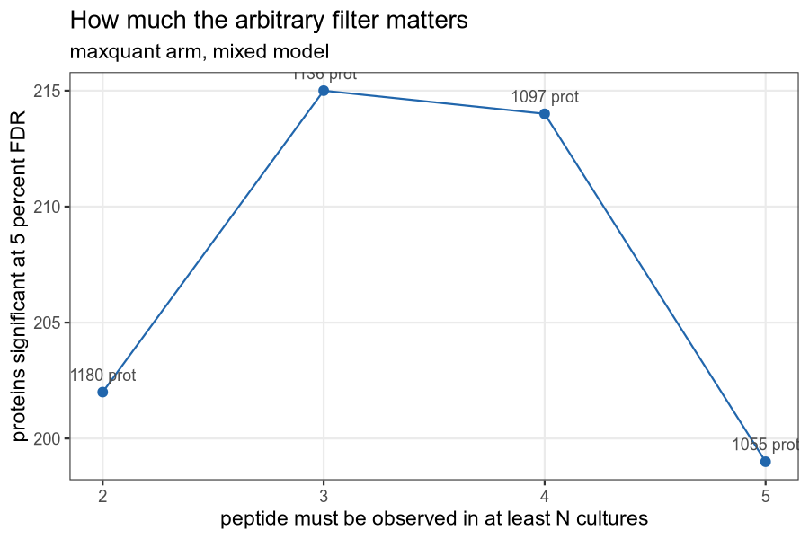
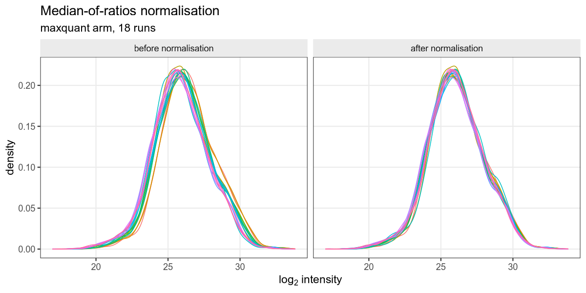

# Two search engines, one set of spectra, and the same biology: ribosomal proteins fall in a Francisella arginine transporter mutant

A reanalysis of PXD001584 run entirely from the command line: Thermo RAW files
through Sage search and label-free quantification to differential abundance,
with a paired entrapment experiment to test whether the reported false
discovery rate is the real one.

## Summary

Sage searched six Q Exactive runs of *Francisella tularensis* subsp. *novicida*
U112 against a 2,100 sequence database in 69 seconds, peaking at 2.5 GB, and
reported 203,316 PSMs. A paired entrapment search over a 4,200 sequence
database put the peptide-level false discovery proportion at 4.9 percent
against a nominal 5 percent, which demonstrates control. At a nominal 1
percent the same estimator returned 1.009 percent, which does not.

The biology reproduces across both search engines. Every ribosomal protein
goes down in the mutant in both arms: 50 of 50 in the authors' MaxQuant
quantification, 52 of 52 in Sage's. The median log2 fold change for ribosomal
proteins is -0.363 from MaxQuant and -0.372 from Sage, two independent
searches of the same spectra against two different databases landing within
0.01 of each other.

Where the two engines diverge is in what they call significant, and the
divergence is mostly power rather than disagreement. Over the 922 protein
groups both could test, Spearman correlation of the test statistics is 0.74
and 42 of each engine's top 100 by p-value are shared. Goeminne and colleagues
reported 52 of 100 shared when they reanalysed this same dataset against the
original authors' numbers, so 42 is the same order of disagreement.

The model you fit matters more than the engine you use. On all eighteen runs,
a random intercept for the biological culture calls 202 of 1,180 protein
groups significant; treating the eighteen runs as independent calls 365.

## Background, for someone who knows RNA-seq

In RNA-seq you count reads against transcripts and the thing you sequence is
the thing you want to measure. Shotgun proteomics is not like that. Proteins
are digested with trypsin into peptides, the peptides are separated by liquid
chromatography, and the mass spectrometer measures peptides. Proteins are
inferred afterwards. Peptide, not protein, is the unit of measurement, and
that single fact drives most of what follows.

In data-dependent acquisition the instrument runs a survey scan (MS1), picks
the most intense precursors from it, and fragments them one at a time (MS2). A
search engine takes each MS2 spectrum, generates theoretical fragments for
every peptide in the database within the precursor mass tolerance, scores
them, and reports the best match. It does not identify peptides. It ranks
candidates and reports the winner, which is a different claim, and it is why
error control matters so much here.

Error control is done by target-decoy competition: search a database of real
sequences alongside reversed or shuffled ones, and use the rate at which
decoys win to estimate how often a real sequence wins by chance. That is an
estimate under an assumption, namely that a false match is equally likely to
land on a target as on a decoy. Target-decoy FDR is a model of the FDR.
Whether the model holds is an empirical question, and the entrapment stage
below is how this pipeline asks it.

The missingness will surprise an RNA-seq reader. In the MaxQuant table 49.4
percent of peptide-by-run cells are zero. That is not sequencing depth. A
peptide is missing mostly because the instrument never chose to fragment it,
and it never chose because the peptide was not intense enough in that run.
Missingness is therefore tied to abundance: the absent values are
systematically the low ones. Imputing them from the observed distribution
pulls low values upward and shrinks the differences being measured, which is
why this pipeline does not impute and says so in the code where the call would
have gone.

One more asymmetry. A zero in a quantification table is the absence of a
measurement, not a measurement of zero, and under a log transform the two
behave nothing alike.

## Data

| | |
|---|---|
| Accession | PXD001584 |
| Organism | *Francisella tularensis* subsp. *novicida* U112, NCBI TaxID 401614 |
| Comparison | wild type against ArgP transporter deletion, locus FTN_0848 |
| Design | 3 cultures per genotype, technical triplicate, 18 runs |
| Instrument | Q Exactive Plus, label free |
| RAW total | 47.3 GiB, mean 2.63 GiB per run |
| Converted here | 6 runs, one injection per culture, 2.2 GiB of mzML.gz |
| Search database | UniProt UP000000762, release 2026_03, downloaded 2026-09-19 |

The eighteen deposited RAW files are not the whole experiment. The authors'
`experimentalDesignTemplate.txt`, inside `MaxQuantOutput.tar.gz` in the same
submission, lists 48 runs across two arginine concentrations and two
acquisition batches. Only the 20 micromolar arm was deposited as RAW: nine
wild type and nine mutant, cultures n3, n4 and n5, three injections each.
`03_fetch_raw.sh` derives `config/samples.tsv` from the PRIDE API rather than
from the paper, which is how that discrepancy surfaced.

PRIDE returns an empty checksum field for every file in this 2015 submission,
so there is no upstream digest to verify against. The pipeline checks the byte
count against the API's `fileSizeBytes` and records its own sha256. Every file
fetched here matched to the byte.

## Pipeline

Each stage is a standalone bash script that sources `project.conf`, prints
usage with `--help`, and skips its work if it has already been done.

### 00, configure and refuse early

Detects threads, available RAM and free disk, projects the footprint, and
writes `project.conf`. With eighteen runs selected on this machine, recorded
in `logs/00_configure_projection.txt`:

```
projected retained mzML.gz  9.5 GiB
projected peak disk         14.1 GiB (mzML + one RAW + 2 GiB headroom)
00_configure: REFUSING to configure a run that cannot finish.
```

That refusal is the stage's purpose. Peak disk is the retained mzML set plus
the single RAW being converted, because Sage needs every run present together
for retention time alignment and cannot search them one at a time.

### 02, search database with provenance

1,719 sequences from UniProt proteome UP000000762 plus 381 contaminants, 2,100
in the search database, with release, date and both checksums in
`results/fasta_provenance.txt`. I reached for the GPM cRAP contaminant set
first and it failed: on 2026-09-19 `ftp.thegpm.org` presented a certificate
that does not match the hostname. Rather than pass `--insecure` to the file
that defines what counts as a contaminant, the script falls through to the
universal library of Frankenfield et al.

### 03 and 04, stream the conversion

Fetch one RAW, convert it, verify the mzML opens and contains spectra, delete
the RAW, move on. After the first file the real conversion ratio is known, so
the projection for the rest becomes arithmetic. Measured across the six runs
converted here, the ratio was 0.1369 to 0.1373, remarkably stable, at 122 to
139 seconds and a peak of 2.8 to 3.1 GB per file.

Three ThermoRawFileParser problems cost real time. The per-file output flag is
`--output`, not `--output_file`, which the tool answers by printing usage and
exiting non-zero. `--noPeakPicking` is a switch that disables centroiding, so
passing it `false` asks for the opposite of what its name suggests. And
indexed mzML combined with gzip is broken in 2.0.0.dev: it writes the `.gz`
correctly, spends two minutes doing so, then reopens the file under its
uncompressed name to append the index and dies with `FileNotFoundException`.
Plain mzML skips the index pass, which Sage does not need, and the output is
half the size: 417 MB against 808 MB for the same run.

### 05 and 06, search and check the FDR

`parallel: false` and `--batch-size 1` by default, trading speed for memory.
Sage writes `results.json` recording every parameter it resolved, which is the
machine-readable methods section, and the pipeline keeps it at
`results/sage_results.json`.

Sage sends a startup report unless told not to. This pipeline opts out by
default. The flag is spelled, in full,
`--disable-telemetry-i-dont-want-to-improve-sage`. The short form the error
message suggests is not an accepted argument in 0.14.6.

### 07 to 10, quantify, model, compare, draw

Stage 07 reduces Sage's `lfq.tsv` to a tidy matrix with one column per run.
Stage 09 reduces the authors' MaxQuant `peptides.txt` to the identical shape.
Both then go through the same `scripts/differential.R`, which is the only
reason a difference in the answer can be attributed to the search engine.

Stage 09 also matches the designs before comparing. The MaxQuant arm can use
all eighteen runs because it needs no RAW files; Sage here saw six. Comparing
those directly would confound the engine with the number of replicates, so the
MaxQuant table is re-analysed on exactly the six runs Sage saw and that matched
result is what gets compared.

## Results

### Sage controls the peptide-level FDR at 5 percent, and the paired estimator is what shows it

**The paired estimator puts the peptide-level FDP at 4.86 percent against a
nominal 5 percent. The combined estimator, on the same data, returns 5.66
percent and cannot reach a conclusion.**



The entrapment database is the 2,100 real sequences plus a shuffled partner
for each, 4,200 in total at a ratio r = 1, built with seed 20260919. Shuffling
permutes each tryptic peptide while holding every K, R and P in place, so the
entrapment protein digests to peptides of identical length, identical amino
acid composition and identical cleavage boundaries. 158,951 of 159,031 target
peptides have a unique partner, none of which collides with a real target
peptide. Sage cannot tell the two halves apart, which is what makes a hit to
an entrapment sequence interpretable as a false positive.

I used all four estimators from Wen et al. 2025, and which one you use decides
what you can say:

| Nominal | Level | N target | N entrapment | Paired, eq 4 | Combined, eq 1 | Lower bound, eq 2 | Conclusion |
|---|---|---|---|---|---|---|---|
| 1 percent | PSM | 56,860 | 293 | n/a | 0.0103 | 0.0051 | inconclusive |
| 1 percent | peptide | 6,801 | 39 | **0.0101** | 0.0114 | 0.0057 | inconclusive |
| 1 percent | protein | 1,183 | 7 | n/a | 0.0118 | 0.0059 | inconclusive |
| 5 percent | PSM | 61,381 | 1,688 | n/a | 0.0535 | 0.0268 | inconclusive |
| 5 percent | peptide | 7,386 | 215 | **0.0486** | 0.0566 | 0.0283 | **control demonstrated** |
| 5 percent | protein | 1,242 | 45 | n/a | 0.0699 | 0.0350 | inconclusive |

Equations (1) and (4) are upper bounds, so a value at or below nominal
demonstrates control. Equation (2) is a lower bound, so only a value above
nominal demonstrates failure. Everything else is inconclusive, and most of
this table is inconclusive. That is the honest reading and it is also the
paper's point: the combined estimator is valid but underpowered, and the
paired estimator is tighter. Here the difference between them is the
difference between a conclusion and a shrug.

An earlier version of my assessment script reported "NOT_CONTROLLED" whenever
an upper bound exceeded nominal. That is wrong, it would have put a false
headline on this section, and the corrected logic is in `_verdict` at the
bottom of `scripts/assess_entrapment.py`.

Protein level is the weakest throughout: 0.0699 against a nominal 0.05. It is
an upper bound, so it does not demonstrate a failure, but it is the number I
would want more runs to pin down. The paired estimator is defined for peptides
and does not extend to protein groups, so the tighter bound is unavailable
exactly where it would help most.

### The same biology out of both engines

**Every ribosomal protein falls in the mutant in both arms, and the two
independent estimates of the effect agree to within 0.01 on the log2 scale.**



| | MaxQuant, 18 runs | Sage, 6 runs |
|---|---|---|
| Protein groups tested | 1,115 | 1,175 |
| Ribosomal groups tested | 50 | 52 |
| Direction | 50 down, 0 up | 52 down, 0 up |
| Sign test | p = 1.8e-15 | p = 4.4e-16 |
| Median log2 FC, ribosomal | -0.363 | -0.372 |
| Median log2 FC, all others | -0.048 | -0.009 |
| Wilcoxon | p = 4.4e-17 | p = 8.0e-16 |
| Ribosomal among significant | 30 of 202 | 1 of 25 |
| Fisher odds ratio | 7.77, p = 1.4e-11 | 0.90, p = 1 |

The last row is the one that looks like a contradiction and is not. The
Wilcoxon test uses every tested protein and both arms agree emphatically. The
Fisher test asks whether ribosomal proteins are over-represented among the
proteins called significant, and the Sage arm has only 25 significant proteins
because it saw six runs instead of eighteen. With that little power there is
no enrichment to detect. Reporting only the Fisher result would suggest the
engines disagree about ribosomes. They do not.

Ramond et al. predicted this. Goeminne et al. reanalysed the same MaxQuant
output in 2016 and reported log2 fold change estimates for 49 ribosomal
proteins, all negative. 50 of 50 and 52 of 52 here is the same finding twice
more.

Finding the keyword took a correction. The two databases name these proteins
differently: NCBI, which the authors searched, writes "30S ribosomal protein
S12", while UniProt has moved to "Small ribosomal subunit protein uS12", which
does not contain the string "ribosomal protein" at all. Matching the plain
phrase found 55 in the MaxQuant annotation and 4 in the UniProt one, which
looks like a biological difference and is pure nomenclature. Both arms now use
one anchored regex that also excludes the enzymes which modify ribosomal
proteins rather than being them.

### The two engines rank proteins similarly and call different numbers significant

**Over the 922 protein groups both could test, Spearman correlation of the
test statistics is 0.74, and 42 of each engine's top 100 by p-value are
shared.**



| | |
|---|---|
| Peptides quantified | Sage 7,038, MaxQuant 10,693 |
| Protein groups | Sage 1,175, MaxQuant 1,106 |
| Testable | Sage 1,113, MaxQuant 981, shared 922 |
| Jaccard, testable | 0.79 |
| Significant at 5 percent FDR | Sage 21, MaxQuant 3, shared 3 |
| Spearman, test statistics | 0.743 |
| Spearman, log2 fold change | 0.701 |
| Pearson, log2 fold change | 0.585 |
| Top 100 by p-value, shared | 42 |

Both arms here are the six-run design, so both are underpowered and the
significant counts are small. The asymmetry in them is worth noting: on
identical runs Sage produced 21 significant proteins and no unfittable ones,
while the MaxQuant table produced 3 significant and 120 that could not be
fitted at all. Sage quantified fewer peptides but distributed them across runs
more completely, and completeness is what the model needs.

I cannot tell you which engine is right from this data. Nothing here is a
ground truth experiment: there is no known fold change and no spiked standard,
so a disagreement between the two identifies a disagreement and nothing more.
That is a real limit and not a failure of the comparison. The rank correlation
of 0.74 says they mostly agree about ordering; the overlap of 42 in 100 says
the tails, which is where everyone actually looks, are substantially different.

### The model matters more than the engine

**Fitting culture as a random intercept calls 202 proteins. Pretending the
eighteen runs are independent calls 365.**



Three injections of one culture are one observation of the biology. The naive
model counts them as three, so it estimates residual variance from
injection-to-injection scatter, which is far smaller than culture-to-culture
scatter. Median standard error under the naive model is 0.73 times the mixed
model's, and median denominator degrees of freedom rise from 14.7 to 17.1.



Everything else about those two fits is identical. The extra 163 proteins are
bought with a variance estimate that does not describe the experiment.

The subset costs more than it looks. Running the same MaxQuant table on six
runs rather than eighteen drops the significant count from 202 to 3, and
raises unfittable proteins from 50 to 120. One injection per culture leaves
measurement noise sitting directly on the biological contrast, so `--subset`
is a concession to disk and a large one.

### Filters, thresholds and what they cost



| Step | MaxQuant, 18 runs | Sage, 6 runs |
|---|---|---|
| Imported | 10,693 | 7,038 |
| Decoys and contaminants removed | 10,490 | 6,909 |
| Non-minimal protein groups removed | 10,461 | 6,900 |
| Observed in at least 2 cultures | 7,542 | 6,899 |
| Protein groups after robustSummary | 1,180 | 1,175 |

Every filter is a function of feature identity or of how often something was
observed. None looks at the difference between genotypes, which is what keeps
the p-value distribution honest.

The two-culture threshold is arbitrary, so here is how much it matters.



| Minimum cultures | Peptides | Proteins | Significant |
|---|---|---|---|
| 2 | 7,542 | 1,180 | 202 |
| 3 | 6,793 | 1,136 | 215 |
| 4 | 6,150 | 1,097 | 214 |
| 5 | 5,485 | 1,055 | 199 |

The count moves between 199 and 215 across the whole range. The conclusion
does not depend on the choice, and reporting that is cheaper than defending
the number.

### Normalisation



Median of ratios on the log2 scale, with per-run offsets from -0.427 to 0.312
in the MaxQuant arm. The alternative was centring each run on its own median,
which is biased by which peptides happen to be missing in a run, since a run
missing many low-abundance peptides has a higher raw median through
composition alone.

### Measured cost

From `logs/stage_metrics.tsv`, written by GNU time:

| Stage | Elapsed | Peak RSS |
|---|---|---|
| RAW to mzML.gz, per run | 122 to 139 s | 2.8 to 3.1 GB |
| Sage LFQ search, 6 runs, 2,100 sequences | 69 s | 2.5 GB |
| Entrapment search, 6 runs, 4,200 sequences | 84 s | 2.6 GB |
| msqrob2, Sage arm | 31 s | 1.0 GB |
| msqrob2, MaxQuant 18 runs with sensitivity sweep | 182 s | 1.1 GB |
| Figures | 3 to 4 s | 0.2 GB |

Downloads dominated everything: 2.6 to 3.0 GB per run at 5 to 10 MB/s, which
is 25 to 45 minutes of the wall clock for every 2 minutes of conversion.

## Repository structure

```
sage_lfq_proteomics_pipeline/
├── config/
│   ├── samples.tsv            generated from the PRIDE API, never typed
│   ├── contrasts.tsv
│   ├── sage_lfq.json          the search parameters
│   └── sage_parameters.md     why each one is set that way, and which came
│                              from the authors rather than from me
├── scripts/
│   ├── 00_configure.sh ... 10_figures.sh
│   ├── lib/common.sh          timing and peak RSS logging
│   ├── build_entrapment_db.py paired shuffled entrapment construction
│   ├── assess_entrapment.py   the four FDP estimators
│   ├── build_peptide_matrix.py  Sage or MaxQuant to one tidy shape
│   ├── differential.R         the msqrob2 workflow, shared by both arms
│   ├── compare_engines.R
│   ├── biological_readout.R
│   ├── figures.R
│   └── verify_repo.sh         the pre-publication checks
├── results/                   tables, provenance, Sage's own results.json
├── figures/                   every figure in this README
├── logs/                      per-stage elapsed time and peak RSS
├── data/                      not tracked, see data/README.md
└── run_all.sh
```

## Usage

The MaxQuant arm needs no RAW files, about 1 GB of disk and roughly three
minutes. It reproduces the model comparison, the ribosomal result and the
sensitivity sweep.

```bash
bash run_all.sh --maxquant-only --yes
```

The full pipeline needs about 14 GiB of free disk for eighteen runs and about
6 GiB for the six-run subset. `00_configure.sh` refuses before anything is
downloaded if that is not available.

```bash
bash run_all.sh --yes              # eighteen runs
bash run_all.sh --subset --yes     # six runs, one injection per culture
bash run_all.sh --from 08          # re-model without re-searching
bash run_all.sh --help             # every stage and every flag
```

`--subset` keeps one technical replicate per culture. With one run per culture
the random intercept has one observation per level and is not identifiable, so
`differential.R` detects that and fits `~ genotype` alone, which in that design
is the correct model rather than the naive one. `results/*_design.tsv` records
which model produced each result.

`bash scripts/verify_repo.sh` runs the publication checks: shellcheck, the
`--help` contract, prose checks, tracked file sizes, and a dump of every
headline number next to the file it came from.

## Limitations

**The eighteen-run Sage search did not run.** The projection is 14.1 GiB peak
and free disk never exceeded 9 GiB during this session, so the pipeline
refused, which is what it was built to do. Six runs were converted and searched
instead. Every Sage number above is a six-run number, and six runs with one
injection each is a weak design: it is why the Sage arm calls 25 proteins
significant and the eighteen-run MaxQuant arm calls 202.

**The search database is not the authors' database.** They searched
`NCBI_Fnovicida.fasta`, recorded in their `parameters.txt`. This pipeline
searches UniProt UP000000762. Their table reports RefSeq WP_ accessions and
Sage reports UniProt ones, so the comparison needs a mapping: 1,625 of 1,719
UniProt entries carry a RefSeq cross-reference, and 62 of the 1,175 Sage
protein groups could not be mapped and are excluded. Protein groups that merge
in one engine and split in the other are also excluded, because forcing them
together would invent agreement or disagreement that is an artefact of
grouping.

**One search parameter I could not recover.** `parameters.txt` records the 20
ppm MS/MS tolerance but not the precursor tolerance, because MaxQuant 1.4 does
precursor matching in two passes and writes neither number. I used 20 ppm
symmetric and said so in `config/sage_parameters.md`. Any undocumented
parameter is a difference I did not control, and this is the one I know about.

**The obvious positive control is unavailable.** ArgP itself, FTN_0848,
UniProt A0Q671, RefSeq WP_003033738, has zero peptides in the MaxQuant table.
A deleted membrane transporter should be the cleanest possible check that the
right strains were compared, and it was not detected in either genotype, so
strain identity rests on the submitters' labelling.

**A keyword check is not an enrichment analysis.** It matches a regex against a
FASTA description. It inherits whatever biases are in how those descriptions
were written, it cannot see a ribosome-associated protein that is not described
as one, and it has no notion of a pathway. The background is correct, the
proteins that could not be fitted are excluded from it, and the test is a
Fisher exact test, but the gene set is a string match.

**No ground truth.** There is no known fold change in this experiment and no
spiked standard, so where Sage and MaxQuant disagree, this data cannot say
which is right. The optional `--dataset shen` path points at PXD003881, which
does have spike-in ground truth, but it needs a human-sized database and
roughly twice the disk and was not run here.

**One bacterial dataset says nothing general about search engines.** A 1,719
protein proteome is close to the smallest realistic search space. Fragment
index behaviour, protein inference and FDR estimation all get harder as the
database grows, and none of this transfers to a human-sized search without
being redone.

**The entrapment result is mostly inconclusive.** One cell of six demonstrates
control. The rest sit between the bounds, which is the expected behaviour of a
valid but conservative estimator on a modest number of runs, and is not
evidence of a problem.

## Data availability

- PRIDE **PXD001584**. The file listing as retrieved is committed at `results/pride_file_listing.json`; per-file sizes and sha256 of what was fetched are in `results/raw_manifest.tsv`.
- UniProt proteome **UP000000762**, release **2026_03** (02-September-2026), downloaded 2026-09-19. Checksums in `results/fasta_provenance.txt`.
- Sage's own record of every resolved search parameter is committed at `results/sage_results.json` and `results/sage_config_used.json`.
- The authors' MaxQuant peptide table is fetched from `statOmics/msqrob2data` and not redistributed here. Its sha256 and retrieval date are in `results/maxquant_source_provenance.txt`.
- The contaminant library is fetched at run time from the Frankenfield et al. repository.

Everything in `results/` is written by a script in `scripts/`. Nothing in it
was edited by hand.

## Citation

- Sage: Lazear MR. Sage: An Open-Source Tool for Fast Proteomics Searching and Quantification at Scale. *J Proteome Res* 2023;22(11):3652-3659. PMID 37819886. doi:10.1021/acs.jproteome.3c00486
- ThermoRawFileParser: Hulstaert N, Shofstahl J, Sachsenberg T, Walzer M, Barsnes H, Martens L, Perez-Riverol Y. *J Proteome Res* 2020;19(1):537-542. PMID 31755270. doi:10.1021/acs.jproteome.9b00328
- Entrapment: Wen B, Freestone J, Riffle M, MacCoss MJ, Noble WS, Keich U. Assessment of false discovery rate control in tandem mass spectrometry analysis using entrapment. *Nat Methods* 2025;22(7):1454-1463. PMID 40524023. doi:10.1038/s41592-025-02719-x
- Picked-peptide FDR: Lin A, Short T, Noble WS, Keich U. Improving Peptide-Level Mass Spectrometry Analysis via Double Competition. *J Proteome Res* 2022;21(10):2412-2420. PMID 36166314. doi:10.1021/acs.jproteome.2c00282
- Dataset: Ramond E, Gesbert G, Guerrera IC, Chhuon C, Dupuis M, Rigard M, Henry T, Barel M, Charbit A. Importance of host cell arginine uptake in Francisella phagosomal escape and ribosomal protein amounts. *Mol Cell Proteomics* 2015;14(4):870-881. PMID 25616868. doi:10.1074/mcp.M114.044552
- msqrob2, method: Goeminne LJE, Gevaert K, Clement L. Peptide-level Robust Ridge Regression Improves Estimation, Sensitivity, and Specificity in Data-dependent Quantitative Label-free Shotgun Proteomics. *Mol Cell Proteomics* 2016;15(2):657-668. PMID 26566788. doi:10.1074/mcp.M115.055897
- msqrob2, summarisation: Sticker A, Goeminne L, Martens L, Clement L. Robust Summarization and Inference in Proteome-wide Label-free Quantification. *Mol Cell Proteomics* 2020;19(7):1209-1219. PMID 32321741. doi:10.1074/mcp.RA119.001624
- Contaminants: Frankenfield AM, Ni J, Ahmed M, Hao L. Protein Contaminants Matter: Building Universal Protein Contaminant Libraries for DDA and DIA Proteomics. *J Proteome Res* 2022;21(9):2104-2113. PMID 35793413. doi:10.1021/acs.jproteome.2c00145
- QFeatures and the statistical workflow are adapted from the msqrob2 vignettes and the statOmics Proteomics Data Analysis course material.

## License

MIT, in `LICENSE`. The statistical workflow in `scripts/differential.R` is
adapted from the msqrob2 documentation and the statOmics course material,
which are CC BY-SA 4.0; anyone redistributing that adaptation should honour
the ShareAlike term.
